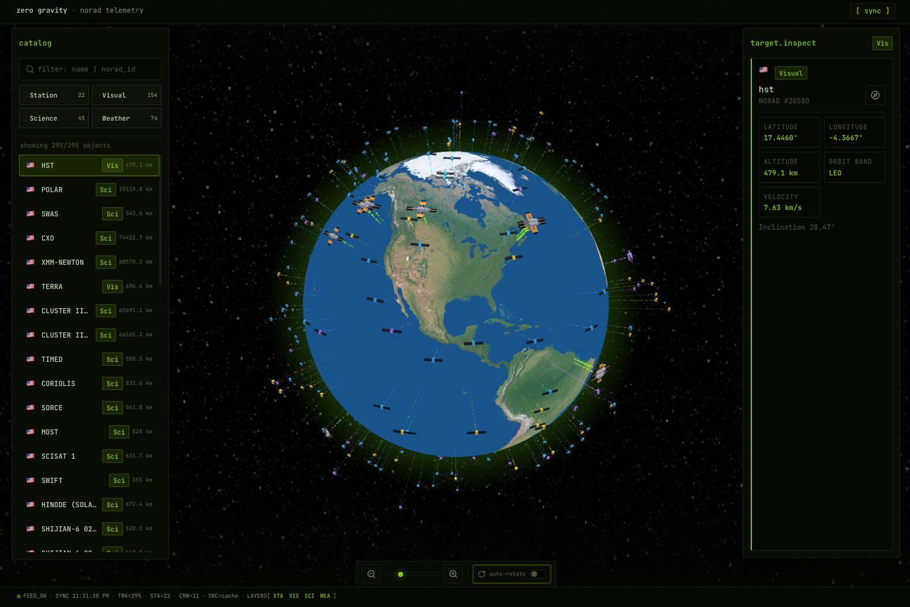
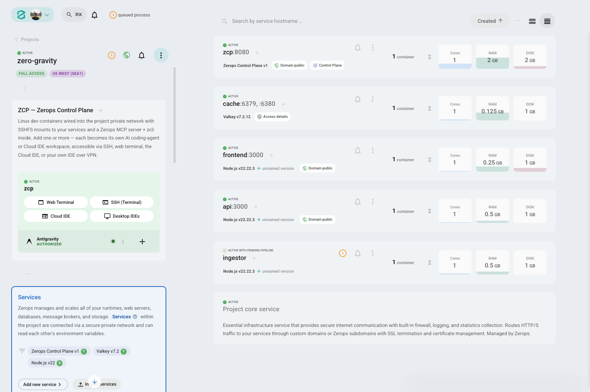

<div align="center">

# 🛰️ ZeroGravity

**Live satellite tracker with an interactive 3D globe**

NORAD TLE data and ISS crew info — polled in the background, cached in Valkey, served to React.

<br />

🚀 **[Live Demo](https://frontend-14c-3000.sea1.zerops.app)** · 🏆 **[WeMakeDevs × Zerops Hackathon](https://wemakedevs.org/hackathons/zerops)**

<br />

```
   ┌─────────────────────────────────────────┐
   │  🌍  track orbit  ·  read telemetry  ·  │
   │      watch the sky move in real time    │
   └─────────────────────────────────────────┘
```

</div>

<!--  -->

*Add `docs/screenshots/globe-overview.png`, then uncomment the image line above.*

---

## ✨ What it does

- 🌍 Renders Earth with satellite positions, orbital paths, and station markers
- 🔍 Lets you search and filter objects (all / stations / visual)
- 📡 Shows telemetry for the selected satellite (lat, lng, altitude, velocity when available)
- 👨‍🚀 Lists astronauts currently in orbit (ISS + Tiangong when data is present)

📚 Data sources: [CelesTrak](https://celestrak.org/) (NORAD groups) and [Open Notify](http://open-notify.org/) (astronaut roster).

---

## 🏗️ Architecture

Four services on **Zerops**:

```
CelesTrak / Open Notify
        │
        ▼
   ingestor  ──writes──▶  cache (Valkey)
                              │
                              ▼
                            api  ◀── /api/satellites, /api/crew
                              │
                              ▼
                          frontend  (Vite + React + react-globe.gl)
```

| Service   | Role |
|-----------|------|
| `cache`   | Managed Valkey 7.2. Keys expire after 60s. |
| `ingestor`| Polls external APIs every 30s, normalizes JSON, writes to cache. |
| `api`     | Express. Reads cache, runs orbital propagation, exposes REST endpoints. |
| `frontend`| Serves the built SPA and proxies `/api/*` to the api service. |

---

## 📁 Repository layout

```
.
├── ingestor/          # background worker
├── api/               # REST API
├── frontend/          # React app + production static server
├── zerops.yaml        # per-service Zerops config (root + service dirs)
├── design.md          # frontend design system
├── GEMINI.md          # project context for Gemini / other AI assistants
└── docs/screenshots/  # README screenshot assets
```

---

## 💻 Running locally

You need Node.js 22 and a Redis-compatible server for the cache layer.

**1. Cache** — run Valkey or Redis locally (default port 6379).

**2. API**

```bash
cd api
npm install
REDIS_HOST=127.0.0.1 npm start
```

**3. Ingestor** *(optional — populates cache)*

```bash
cd ingestor
npm install
REDIS_HOST=127.0.0.1 node index.js
```

**4. Frontend**

The Vite dev config proxies `/api` to `http://api:3000` (Zerops internal DNS). For local work, point it at your machine:

```bash
cd frontend
npm install
# edit vite.config.js proxy target to http://127.0.0.1:3000, or set API_HOST when using server.js
npm run dev
```

Open http://localhost:3000

**Production build**

```bash
cd frontend
npm run build
API_HOST=http://127.0.0.1:3000 npm start
```

---

## 🔌 API

| Endpoint | Description |
|----------|-------------|
| `GET /api/satellites` | Satellite list with propagated positions |
| `GET /api/crew` | Current astronaut roster |

Example (deployed):

- https://api-14c-3000.sea1.zerops.app/api/satellites
- https://api-14c-3000.sea1.zerops.app/api/crew

---

## 🚀 Deploying on Zerops

Each service has its own `zerops.yaml`. Push with the Zerops CLI:

```bash
zcli push ingestor
zcli push api
zcli push frontend
```

The root `zerops.yaml` mirrors the service definitions. Cache is provisioned as a managed Valkey service; connection strings are injected as `${cache_*}` env vars.

<!--  -->

*Add `docs/screenshots/zerops-dashboard.png`, then uncomment the image line above.*

---

## 🎨 Design

The UI uses Hallmark **Midnight** — cool dark canvas, warm amber accents, Syne + Figtree. See [`design.md`](design.md). Tokens: `frontend/tokens.css`.

Fonts: **Syne** (display), **Figtree** (everything else).

---

## 🤖 AI-assisted development

This project was built with AI coding assistants:

- **[Cursor](https://cursor.com/)** — primary editor; used for implementation, refactors, and iteration across the stack
- **[Antigravity](https://antigravity.google/)** — used during early development and exploration

---

## 🧰 Built with

- [Zerops](https://zerops.io/) — hosting and managed Valkey
- [React](https://react.dev/) + [Vite](https://vitejs.dev/)
- [react-globe.gl](https://github.com/vasturiano/react-globe.gl) / Three.js
- [Hallmark](https://github.com/nutlope/hallmark) — design system and UI audit

---

<div align="center">

📄 **MIT License**

</div>
